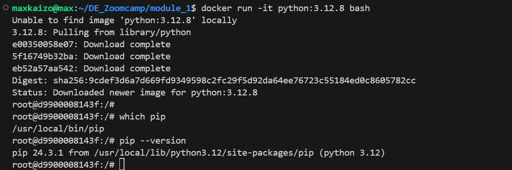

# Homework

## Question 1

Run docker with the python:3.12.8 image in an interactive mode, use the entrypoint bash.

What's the version of pip in the image?

 `docker run -it python:3.12.8 bash`

 

 ## Question 2

 Answer = postgres:5433

 ## Question 3

### Preparation

I've loaded the zones file with this notebook [data_ingest.ipynb](https://github.com/Maxkaizo/DE_Zoomcamp/blob/main/module_1/homework/data_ingest.ipynb)

