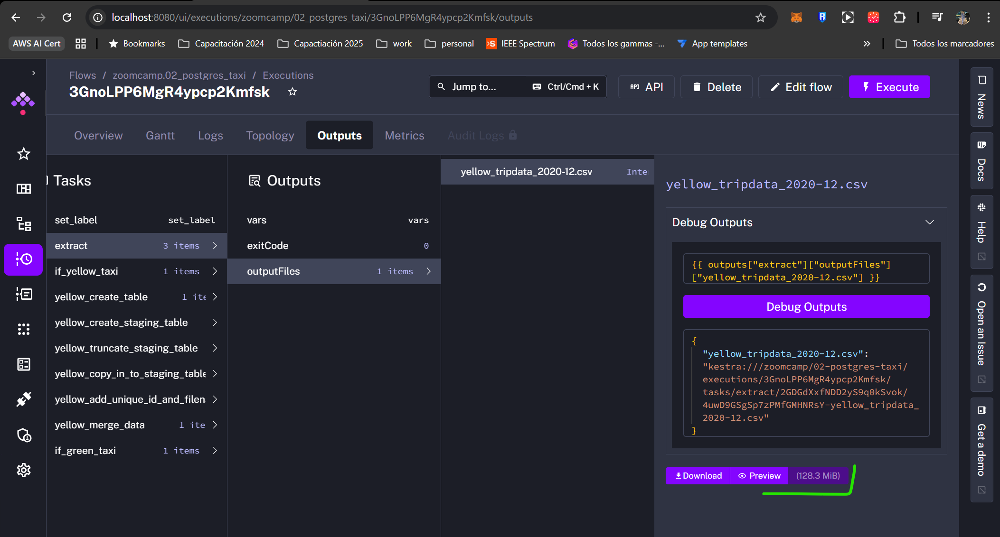
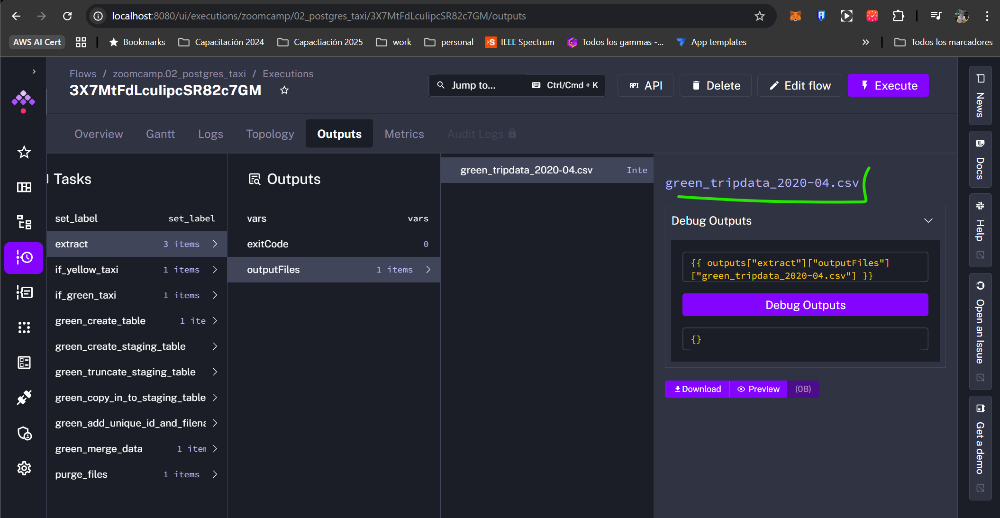

# Question 1

1. Within the execution for Yellow Taxi data for the year 2020 and month 12: what is the uncompressed file size (i.e. the output file yellow_tripdata_2020-12.csv of the extract task)?

    - 128.3 MB
    - 134.5 MB
    - 364.7 MB
    - 692.6 MB

- Answer: 128.3 MB

# Question 2

2. What is the rendered value of the variable file when the inputs taxi is set to green, year is set to 2020, and month is set to 04 during execution?

    - {{inputs.taxi}}_tripdata_{{inputs.year}}-{{inputs.month}}.csv
    - green_tripdata_2020-04.csv
    - green_tripdata_04_2020.csv
    - green_tripdata_2020.csv

- Answer: green_tripdata_2020-04.csv

# Question 3

