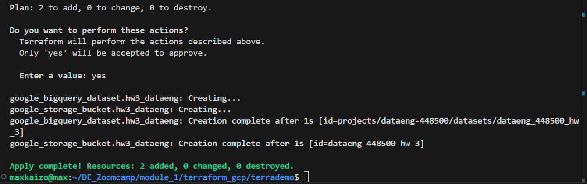

# Homework 3

## Preparation

- Bucket and dataset creation

- Data loading

## Table creation (No partition, no cluster)

## Question 1

Question 1: What is count of records for the 2024 Yellow Taxi Data?

- 65,623
- 840,402
- 20,332,093
- 85,431,289

Answer: 20,332,093

# Question 2

Write a query to count the distinct number of PULocationIDs for the entire dataset on both the tables.
What is the estimated amount of data that will be read when this query is executed on the External Table and the Table?

- 18.82 MB for the External Table and 47.60 MB for the Materialized Table
- 0 MB for the External Table and 155.12 MB for the Materialized Table
- 2.14 GB for the External Table and 0MB for the Materialized Table
- 0 MB for the External Table and 0MB for the Materialized Table

Answer: - 0 MB for the External Table and 155.12 MB for the Materialized Table

