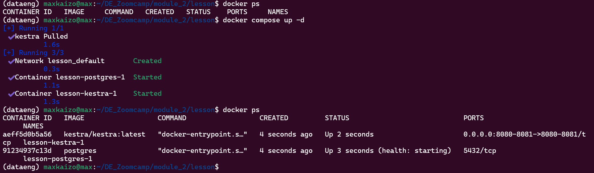
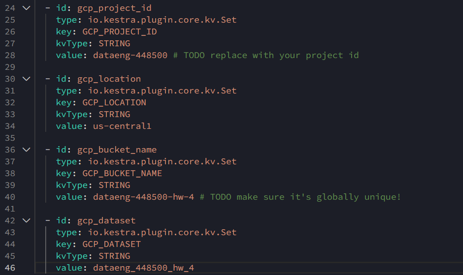
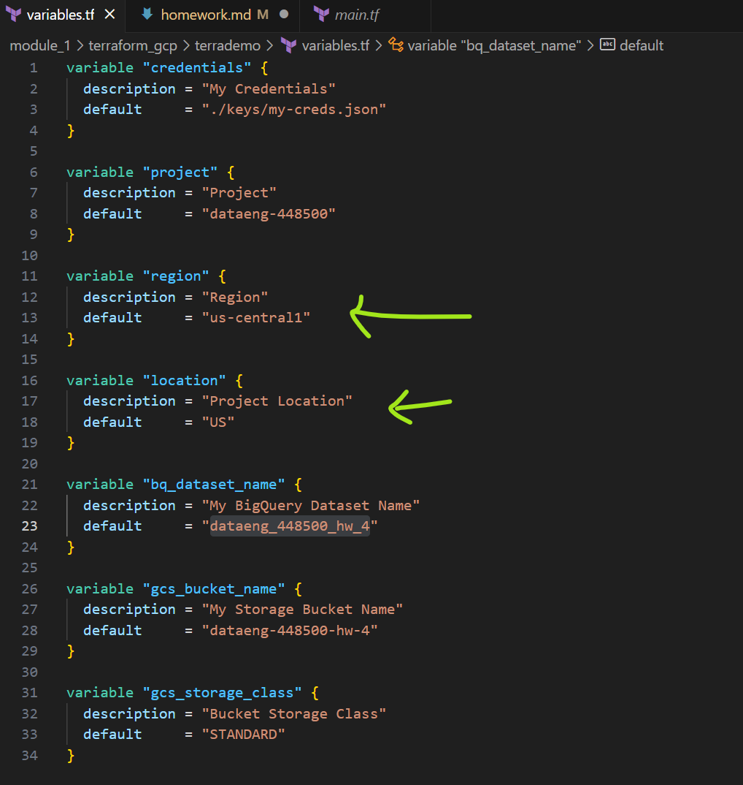
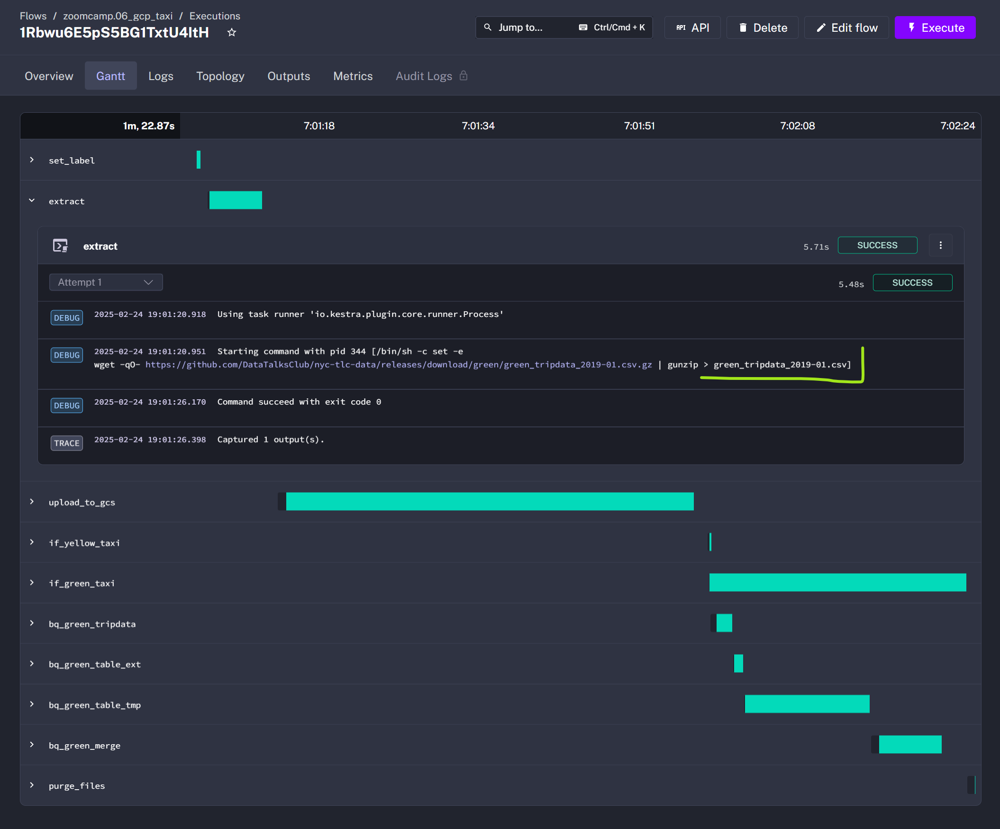
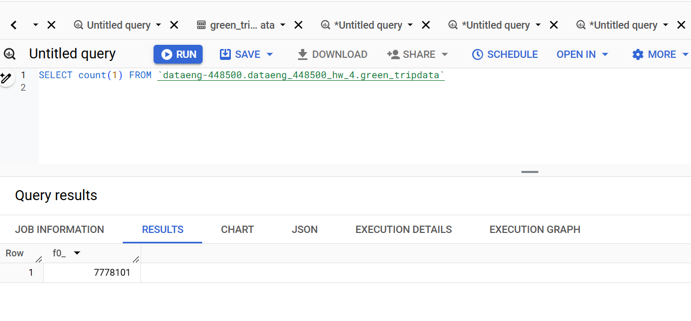
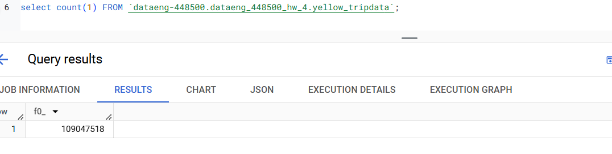

# Getting things ready!

For this homework, you will need the following datasets:

- Green Taxi dataset (2019 and 2020)
- Yellow Taxi dataset (2019 and 2020)
- For Hire Vehicle dataset (2019)

Before you start

Make sure you, at least, have them in GCS with a External Table OR a Native Table - use whichever method you prefer to accomplish that (Workflow Orchestration with pandas-gbq, dlt for gcs, dlt for BigQuery, gsutil, etc)

- You should have exactly 7,778,101 records in your Green Taxi table
- You should have exactly 109,047,518 records in your Yellow Taxi table
- You should have exactly 43,244,696 records in your FHV table
- Build the staging models for green/yellow as shown in here
- Build the dimension/fact for taxi_trips joining with dim_zones as shown in here

Note: If you don't have access to GCP, you can spin up a local Postgres instance and ingest the datasets above

## Notes

I guess for this task I can use:

- Terraform, to create my gcp bucket and dataset
- Kestra, to download files from repo and upload to BigQuery (I should create the flow for fhv)
- DBT, to mantain a unique db (or view)

Let's try it

## Create a bucket and a dataset with Terraform

- I'll edit my main.tf and variables.tf files to create an environment for week 4 homework


- Once edit I'll create my infra with

```bash
terraform init
terraform plan
terraform apply
```


## Move files from repo to GCP Sotrage (bucket)

I'll have to start my Kestra server, run a backfill for green and yellow sets and create a flow for FHV Set.

- Check if Kestra server is running and start it if not



- Now that the server is running, I'l adjust the gcp infra definition within kestra by editing the 04_gcp_kv.yaml file (Thanks to Manuel Guerra for the reminder and his useful notes)




- I'll test the flow with only one file


At this point I encountered an issue, as I didn't know that in the terraform configuration file, the location is only used for big query (or I forgot it) and had some problems, because I left it as US, it was fixed when I changed it to us-central1



Once this was fixed, I could run fine the loading process for the first file



So now, I'm using the backfill process to extract all files for Green Taxis

Green trip data loaded succesfuly



Let's do the Yellow trip data



Yellow trip data loaded succesfuly

How can I Load FHV data? 

- Manualy? 
Download 24 files, upload to a gc bucket and then create an external table and ingest every file 

- Through a Kestra workflow
I can edit the green and yellow flow file and replicate the process, not much work, y only have to pay attention to the flow definition, in fact I could only add it as a third option in the existent file

- Through dlt?
I want to do it this way, but I cant remember how could I do it, I'd have to rewatch the webinar and 

I guess for me is better to do it this way, so I can refresh the concpets and I would leverage all the solutions from the previous lessons

So I used this [tutorial](https://dlthub.com/docs/tutorial/rest-api) as a refresher and with chatgpt help, I managed to create this [script](https://github.com/Maxkaizo/DE_Zoomcamp/blob/main/module_4/fhv_dlt.py) to do the Extract and Load phase with dlt 


## referencias de clase de big query
https://github.com/DataTalksClub/data-engineering-zoomcamp/blob/main/03-data-warehouse/big_query.sql

```SQL

-- Creating external table referring to gcs path
CREATE OR REPLACE EXTERNAL TABLE `taxi-rides-ny.nytaxi.external_yellow_tripdata`
OPTIONS (
  format = 'CSV',
  uris = ['gs://nyc-tl-data/trip data/yellow_tripdata_2019-*.csv', 'gs://nyc-tl-data/trip data/yellow_tripdata_2020-*.csv']
);


-- Create a non partitioned table from external table
CREATE OR REPLACE TABLE taxi-rides-ny.nytaxi.yellow_tripdata_non_partitioned AS
SELECT * FROM taxi-rides-ny.nytaxi.external_yellow_tripdata;


-- Create a partitioned table from external table
CREATE OR REPLACE TABLE taxi-rides-ny.nytaxi.yellow_tripdata_partitioned
PARTITION BY
  DATE(tpep_pickup_datetime) AS
SELECT * FROM taxi-rides-ny.nytaxi.external_yellow_tripdata;
```

a ver


