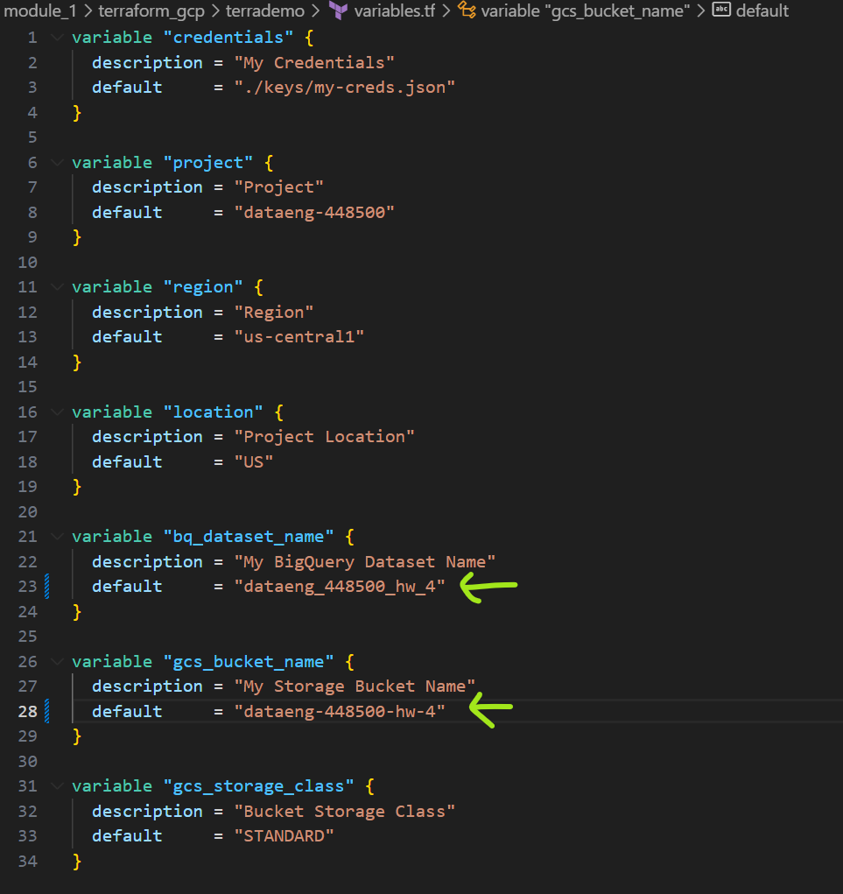

# Getting things ready!

For this homework, you will need the following datasets:

- Green Taxi dataset (2019 and 2020)
- Yellow Taxi dataset (2019 and 2020)
- For Hire Vehicle dataset (2019)

Before you start

Make sure you, at least, have them in GCS with a External Table OR a Native Table - use whichever method you prefer to accomplish that (Workflow Orchestration with pandas-gbq, dlt for gcs, dlt for BigQuery, gsutil, etc)

- You should have exactly 7,778,101 records in your Green Taxi table
- You should have exactly 109,047,518 records in your Yellow Taxi table
- You should have exactly 43,244,696 records in your FHV table
- Build the staging models for green/yellow as shown in here
- Build the dimension/fact for taxi_trips joining with dim_zones as shown in here

Note: If you don't have access to GCP, you can spin up a local Postgres instance and ingest the datasets above

## Notes

I guess for this task I can use:

- Terraform, to create my gcp bucket and dataset
- Kestra, to download files from repo and upload to BigQuery (I should create the flow for fhv)
- DBT, to mantain a unique db (or view)

Let's try it

### Create a bucket and a dataset

- I'll edit my main.tf and variables.tf files to create an environment for week 4 homework



- Once edit I'll create my infra with

`terraform init`

`terraform plan`

`terraform apply`

```bash
terraform init
terraform plan
terraform apply


