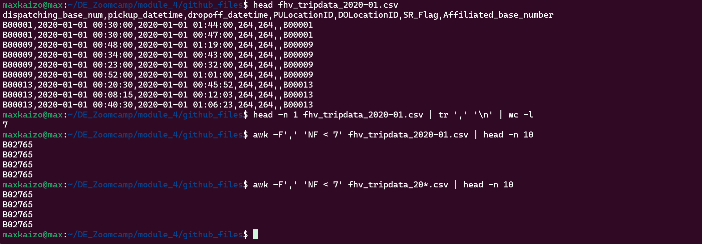
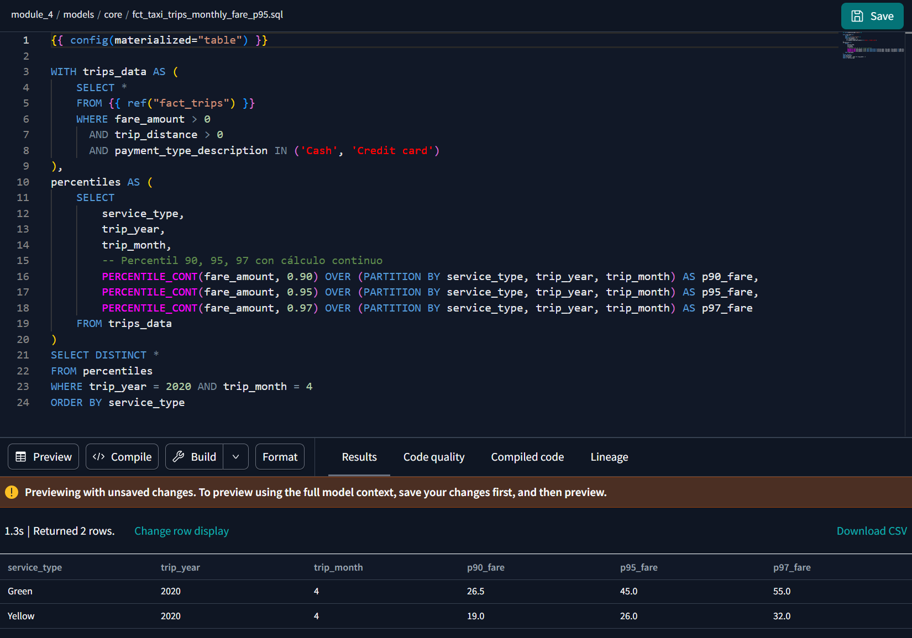

# Preparation

## Getting things ready!

For this homework, you will need the following datasets:

- Green Taxi dataset (2019 and 2020)
- Yellow Taxi dataset (2019 and 2020)
- For Hire Vehicle dataset (2019)

Before you start

Make sure you, at least, have them in GCS with a External Table OR a Native Table - use whichever method you prefer to accomplish that (Workflow Orchestration with pandas-gbq, dlt for gcs, dlt for BigQuery, gsutil, etc)

- You should have exactly 7,778,101 records in your Green Taxi table
- You should have exactly 109,047,518 records in your Yellow Taxi table
- You should have exactly 43,244,696 records in your FHV table
- Build the staging models for green/yellow as shown in here
- Build the dimension/fact for taxi_trips joining with dim_zones as shown in here

Note: If you don't have access to GCP, you can spin up a local Postgres instance and ingest the datasets above

### Notes

I guess for this task I can use:

- Terraform, to create my gcp bucket and dataset
- Kestra, to download files from repo and upload to BigQuery (I should create the flow for fhv)
- DBT, to mantain a unique db (or view)

Let's try it

### Create a bucket and a dataset with Terraform

- I'll edit my main.tf and variables.tf files to create an environment for week 4 homework


- Once edit I'll create my infra with

```bash
terraform init
terraform plan
terraform apply
```


### Move files from repo to GCP Storage (bucket)

I'll have to start my Kestra server, run a backfill for green and yellow sets and create a flow for FHV Set.

- Check if Kestra server is running and start it if not


- Now that the server is running, I'l adjust the gcp infra definition within kestra by editing the 04_gcp_kv.yaml file (Thanks to Manuel Guerra for the reminder and his useful notes)


- I'll test the flow with only one file


At this point I encountered an issue, as I didn't know that in the terraform configuration file, the location is only used for big query (or I forgot it) and had some problems, because I left it as US, it was fixed when I changed it to us-central1


Once this was fixed, I could run fine the loading process for the first file


So now, I'm using the backfill process to extract all files for Green Taxis

Green trip data loaded succesfuly


Let's do the Yellow trip data


Yellow trip data loaded succesfuly

How can I Load FHV data? 

- Manualy? 
Download 24 files, upload to a gc bucket and then create an external table and ingest every file 

- Through a Kestra workflow
I can edit the green and yellow flow file and replicate the process, not much work, y only have to pay attention to the flow definition, in fact I could only add it as a third option in the existent file

- Through dlt?
I want to do it this way, but I cant remember how could I do it, I'd have to rewatch the webinar and 

I guess for me is better to do it this way, so I can refresh the concpets and I would leverage all the solutions from the previous lessons

So I used this [tutorial](https://dlthub.com/docs/tutorial/rest-api) as a refresher and (with chatgpt help), I managed to create this [script](https://github.com/Maxkaizo/DE_Zoomcamp/blob/main/module_4/fhv_dlt.py) to do the Extract and Load phase with dlt 


### Ingest data to BigQuery

So now that I have all the files loaded, I can create my external table and then materialize a new one to use it as source for dbt


(I'm using lesson 3 instructions)
https://github.com/DataTalksClub/data-engineering-zoomcamp/blob/main/03-data-warehouse/big_query.sql

```SQL

-- Creating external table referring to gcs path
CREATE OR REPLACE EXTERNAL TABLE `taxi-rides-ny.nytaxi.external_yellow_tripdata`
OPTIONS (
  format = 'CSV',
  uris = ['gs://nyc-tl-data/trip data/yellow_tripdata_2019-*.csv', 'gs://nyc-tl-data/trip data/yellow_tripdata_2020-*.csv']
);

-- Create a non partitioned table from external table
CREATE OR REPLACE TABLE taxi-rides-ny.nytaxi.yellow_tripdata_non_partitioned AS
SELECT * FROM taxi-rides-ny.nytaxi.external_yellow_tripdata;


-- Create a partitioned table from external table
CREATE OR REPLACE TABLE taxi-rides-ny.nytaxi.yellow_tripdata_partitioned
PARTITION BY
  DATE(tpep_pickup_datetime) AS
SELECT * FROM taxi-rides-ny.nytaxi.external_yellow_tripdata;


CREATE OR REPLACE EXTERNAL TABLE `dataeng-448500.dataeng_448500_hw_4.fhv_tripdata_ext`
OPTIONS (
  format = 'CSV',
  uris = ['gs://dataeng-448500-hw-4/fhv_tripdata_2019-*.csv', 'gs://dataeng-448500-hw-4/fhv_tripdata_2020-*.csv']
);

CREATE OR REPLACE TABLE `dataeng-448500.dataeng_448500_hw_4.fhv_tripdata`
PARTITION BY
  DATE(pickup_datetime) AS
SELECT * FROM `dataeng-448500.dataeng_448500_hw_4.fhv_tripdata_ext`
```

At this point I've encountered a problem, as it seems that some files have incomplete lines, as stated in this error


I tryed to re-download the file, but the problem comes from the source file, I also checked the rest of the files, so I'll fix it locally and then I'll reload it to my bucket




Turns out that I made a mistake, because the instructions required fhv files only for 2019, not for 2020

let's remove files and validate


Now I have the right amount of records in each dataset, I can start the homework now XD

### Build staging models in dbt

For this I have to create a new project on dbt


I have the configuration now, and I shloud initialize on dbt


#### Side note

While I was creating the models on dbt, I identified that in the lesson's models Victoria creates a CTE to identify and filter out duplicated records, but she is only using 2 columns (vendorid, lpep_pickup_datetime), maybe this is not the best way as it could mark some records as duplicated when they're not.

I tested the difference using 2 and 3 fields in fhv and it confirms my suspision, so I'll keep 3

Using 2 columns, 197,124 records were identified as duplicated, including some incorrect examples


and Using 3 columns only 23,165 records were identified as duplicated


### Create models

I've created my [models](https://github.com/Maxkaizo/DE_Zoomcamp/tree/main/module_4/models).

And it looks like this


Now we can start with the homework

# Question 1: Understanding dbt model resolution

Provided you've got the following sources.yaml
```yaml
version: 2

sources:
  - name: raw_nyc_tripdata
    database: "{{ env_var('DBT_BIGQUERY_PROJECT', 'dtc_zoomcamp_2025') }}"
    schema:   "{{ env_var('DBT_BIGQUERY_SOURCE_DATASET', 'raw_nyc_tripdata') }}"
    tables:
      - name: ext_green_taxi
      - name: ext_yellow_taxi
```

with the following env variables setup where `dbt` runs:
```shell
export DBT_BIGQUERY_PROJECT=myproject
export DBT_BIGQUERY_DATASET=my_nyc_tripdata
```

What does this .sql model compile to?
```sql
select * 
from {{ source('raw_nyc_tripdata', 'ext_green_taxi' ) }}
```

- `select * from dtc_zoomcamp_2025.raw_nyc_tripdata.ext_green_taxi`
- `select * from dtc_zoomcamp_2025.my_nyc_tripdata.ext_green_taxi`
- `select * from myproject.raw_nyc_tripdata.ext_green_taxi`
- `select * from myproject.my_nyc_tripdata.ext_green_taxi`
- `select * from dtc_zoomcamp_2025.raw_nyc_tripdata.green_taxi`


## Answer:

Ok, so for this question, I can rationalize the answer, but I can also try it in a test model, I'll do both

- select * from myproject.my_nyc_tripdata.ext_green_taxi

My rationale is that as the environmental variables are defined at a project level, the compilation process should use them, the second argument at the sorices definition is used in case that there is no variable defined, lets try it


Ok, I missed that tricky one, because even if the dataset env variable is invoked, the names do not match, so the compiling process uses the default stated at the sources.yaml file


The final answer is:

- select * from myproject.raw_nyc_tripdata.ext_green_taxi

# Question 2: dbt Variables & Dynamic Models

Say you have to modify the following dbt_model (`fct_recent_taxi_trips.sql`) to enable Analytics Engineers to dynamically control the date range. 

- In development, you want to process only **the last 7 days of trips**
- In production, you need to process **the last 30 days** for analytics

```sql
select *
from {{ ref('fact_taxi_trips') }}
where pickup_datetime >= CURRENT_DATE - INTERVAL '30' DAY
```

What would you change to accomplish that in a such way that command line arguments takes precedence over ENV_VARs, which takes precedence over DEFAULT value?

- Add `ORDER BY pickup_datetime DESC` and `LIMIT {{ var("days_back", 30) }}`
- Update the WHERE clause to `pickup_datetime >= CURRENT_DATE - INTERVAL '{{ var("days_back", 30) }}' DAY`
- Update the WHERE clause to `pickup_datetime >= CURRENT_DATE - INTERVAL '{{ env_var("DAYS_BACK", "30") }}' DAY`
- Update the WHERE clause to `pickup_datetime >= CURRENT_DATE - INTERVAL '{{ var("days_back", env_var("DAYS_BACK", "30")) }}' DAY`
- Update the WHERE clause to `pickup_datetime >= CURRENT_DATE - INTERVAL '{{ env_var("DAYS_BACK", var("days_back", "30")) }}' DAY`


## Answer:

To answer this I used two references from the dbt docs

1. [environmental](https://docs.getdbt.com/docs/build/environment-variables) variables usage
2. [var](https://docs.getdbt.com/reference/dbt-jinja-functions/var) function

And the answer is a combination, first you define the variable so the user can call it an then you set a environmental variable as the default value of the regular which also has a default value.

So the final answer is the 4th option

- Update the WHERE clause to pickup_datetime >= CURRENT_DATE - INTERVAL '{{ var("days_back", env_var("DAYS_BACK", "30")) }}' DAY


# Question 3: dbt Data Lineage and Execution

Considering the data lineage below **and** that taxi_zone_lookup is the **only** materialization build (from a .csv seed file):


Select the option that does **NOT** apply for materializing `fct_taxi_monthly_zone_revenue`:

- `dbt run`
- `dbt run --select +models/core/dim_taxi_trips.sql+ --target prod`
- `dbt run --select +models/core/fct_taxi_monthly_zone_revenue.sql`
- `dbt run --select +models/core/`
- `dbt run --select models/staging/+`

## Answer:

- `dbt run --select models/staging/+`

This is the correct answer, as this command will only run the models included in the staging folder and their dependencies, which are the dimension models."

### Question 4: dbt Macros and Jinja

Consider you're dealing with sensitive data (e.g.: [PII](https://en.wikipedia.org/wiki/Personal_data)), that is **only available to your team and very selected few individuals**, in the `raw layer` of your DWH (e.g: a specific BigQuery dataset or PostgreSQL schema), 

 - Among other things, you decide to obfuscate/masquerade that data through your staging models, and make it available in a different schema (a `staging layer`) for other Data/Analytics Engineers to explore

- And **optionally**, yet  another layer (`service layer`), where you'll build your dimension (`dim_`) and fact (`fct_`) tables (assuming the [Star Schema dimensional modeling](https://www.databricks.com/glossary/star-schema)) for Dashboarding and for Tech Product Owners/Managers

You decide to make a macro to wrap a logic around it:

```sql


    
    

     {{- env_var(target_env_var) -}}
                        {{- env_var(stging_env_var, env_var(target_env_var)) -}}
    


```

And use on your staging, dim_ and fact_ models as:
```sql
{{ config(
    schema=resolve_schema_for('core'), 
) }}
```

That all being said, regarding macro above, **select all statements that are true to the models using it**:
- Setting a value for  `DBT_BIGQUERY_TARGET_DATASET` env var is mandatory, or it'll fail to compile
- Setting a value for `DBT_BIGQUERY_STAGING_DATASET` env var is mandatory, or it'll fail to compile
- When using `core`, it materializes in the dataset defined in `DBT_BIGQUERY_TARGET_DATASET`
- When using `stg`, it materializes in the dataset defined in `DBT_BIGQUERY_STAGING_DATASET`, or defaults to `DBT_BIGQUERY_TARGET_DATASET`
- When using `staging`, it materializes in the dataset defined in `DBT_BIGQUERY_STAGING_DATASET`, or defaults to `DBT_BIGQUERY_TARGET_DATASET`


## Answer:

- When using `core`, it materializes in the dataset defined in `DBT_BIGQUERY_TARGET_DATASET`
- When using `stg`, it materializes in the dataset defined in `DBT_BIGQUERY_STAGING_DATASET`, or defaults to `DBT_BIGQUERY_TARGET_DATASET`
- When using `staging`, it materializes in the dataset defined in `DBT_BIGQUERY_STAGING_DATASET`, or defaults to `DBT_BIGQUERY_TARGET_DATASET`


This is because every model different from core should work as staging

# Serious SQL

## Serious SQL

Alright, in module 1, you had a SQL refresher, so now let's build on top of that with some serious SQL.

These are not meant to be easy - but they'll boost your SQL and Analytics skills to the next level.  
So, without any further do, let's get started...

You might want to add some new dimensions `year` (e.g.: 2019, 2020), `quarter` (1, 2, 3, 4), `year_quarter` (e.g.: `2019/Q1`, `2019-Q2`), and `month` (e.g.: 1, 2, ..., 12), **extracted from pickup_datetime**, to your `fct_taxi_trips` OR `dim_taxi_trips.sql` models to facilitate filtering your queries

- I'm taking this advice and I'll add some dimensions through my fact_trips.sql model using this [blog](https://docs.getdbt.com/blog/extract-sql-love-letter#how-to-use-the-extract-function) entry from dbt's docs.


### Question 5: Taxi Quarterly Revenue Growth

1. Create a new model `fct_taxi_trips_quarterly_revenue.sql`
2. Compute the Quarterly Revenues for each year for based on `total_amount`
3. Compute the Quarterly YoY (Year-over-Year) revenue growth 
  * e.g.: In 2020/Q1, Green Taxi had -12.34% revenue growth compared to 2019/Q1
  * e.g.: In 2020/Q4, Yellow Taxi had +34.56% revenue growth compared to 2019/Q4

Considering the YoY Growth in 2020, which were the yearly quarters with the best (or less worse) and worst results for green, and yellow

- green: {best: 2020/Q2, worst: 2020/Q1}, yellow: {best: 2020/Q2, worst: 2020/Q1}
- green: {best: 2020/Q2, worst: 2020/Q1}, yellow: {best: 2020/Q3, worst: 2020/Q4}
- green: {best: 2020/Q1, worst: 2020/Q2}, yellow: {best: 2020/Q2, worst: 2020/Q1}
- green: {best: 2020/Q1, worst: 2020/Q2}, yellow: {best: 2020/Q1, worst: 2020/Q2}
- green: {best: 2020/Q1, worst: 2020/Q2}, yellow: {best: 2020/Q3, worst: 2020/Q4}

#### Side note
At this point once I've created the additional dimension, I've noticed that the resulting view (fact_trips) varies slightly each time I run the project, I don't know the reason, I've posted this issue on slack, hope someone provides clarification.


### Answer

The answer is 

- green: {best: 2020/Q1, worst: 2020/Q2}, yellow: {best: 2020/Q1, worst: 2020/Q2}


this was a tricky one also, I should study and practice a lot with this kind of examples


### Question 6: P97/P95/P90 Taxi Monthly Fare

1. Create a new model `fct_taxi_trips_monthly_fare_p95.sql`
2. Filter out invalid entries (`fare_amount > 0`, `trip_distance > 0`, and `payment_type_description in ('Cash', 'Credit Card')`)
3. Compute the **continous percentile** of `fare_amount` partitioning by service_type, year and and month

Now, what are the values of `p97`, `p95`, `p90` for Green Taxi and Yellow Taxi, in April 2020?

- green: {p97: 55.0, p95: 45.0, p90: 26.5}, yellow: {p97: 52.0, p95: 37.0, p90: 25.5}
- green: {p97: 55.0, p95: 45.0, p90: 26.5}, yellow: {p97: 31.5, p95: 25.5, p90: 19.0}
- green: {p97: 40.0, p95: 33.0, p90: 24.5}, yellow: {p97: 52.0, p95: 37.0, p90: 25.5}
- green: {p97: 40.0, p95: 33.0, p90: 24.5}, yellow: {p97: 31.5, p95: 25.5, p90: 19.0}
- green: {p97: 55.0, p95: 45.0, p90: 26.5}, yellow: {p97: 52.0, p95: 25.5, p90: 19.0}

### Answer

The answer is

- green: {p97: 55.0, p95: 45.0, p90: 26.5}, yellow: {p97: 31.5, p95: 25.5, p90: 19.0}



### Question 7: Top #Nth longest P90 travel time Location for FHV

Prerequisites:
* Create a staging model for FHV Data (2019), and **DO NOT** add a deduplication step, just filter out the entries where `where dispatching_base_num is not null`
* Create a core model for FHV Data (`dim_fhv_trips.sql`) joining with `dim_zones`. Similar to what has been done [here](../../../04-analytics-engineering/taxi_rides_ny/models/core/fact_trips.sql)
* Add some new dimensions `year` (e.g.: 2019) and `month` (e.g.: 1, 2, ..., 12), based on `pickup_datetime`, to the core model to facilitate filtering for your queries

Now...
1. Create a new model `fct_fhv_monthly_zone_traveltime_p90.sql`
2. For each record in `dim_fhv_trips.sql`, compute the [timestamp_diff](https://cloud.google.com/bigquery/docs/reference/standard-sql/timestamp_functions#timestamp_diff) in seconds between dropoff_datetime and pickup_datetime - we'll call it `trip_duration` for this exercise
3. Compute the **continous** `p90` of `trip_duration` partitioning by year, month, pickup_location_id, and dropoff_location_id

For the Trips that **respectively** started from `Newark Airport`, `SoHo`, and `Yorkville East`, in November 2019, what are **dropoff_zones** with the 2nd longest p90 trip_duration ?

- LaGuardia Airport, Chinatown, Garment District
- LaGuardia Airport, Park Slope, Clinton East
- LaGuardia Airport, Saint Albans, Howard Beach
- LaGuardia Airport, Rosedale, Bath Beach
- LaGuardia Airport, Yorkville East, Greenpoint


### Answer

- LaGuardia Airport, Chinatown, Garment District

