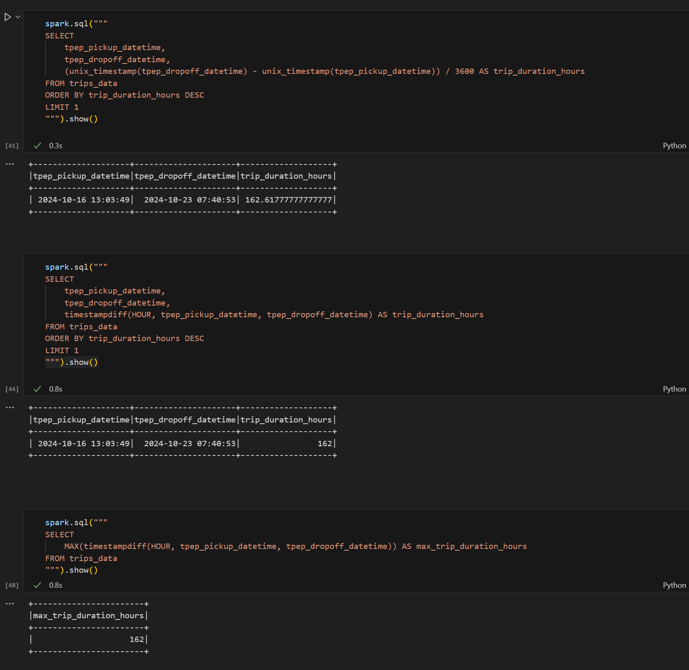

# Spark installation

# Spark version

# Partition Size

# Record count

# Longest Trip

https://stackoverflow.com/questions/60386256/sparksql-difference-between-two-time-stamps-in-minutes

# User interface

# Least Frequent PULocation
