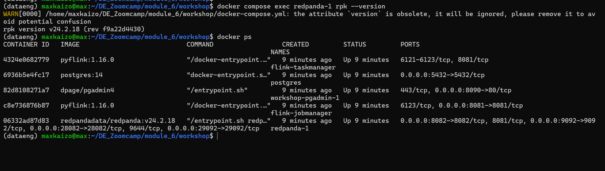
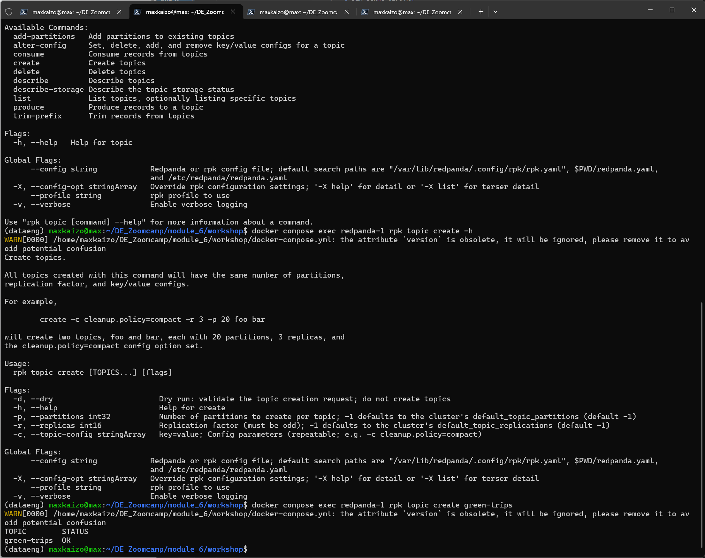
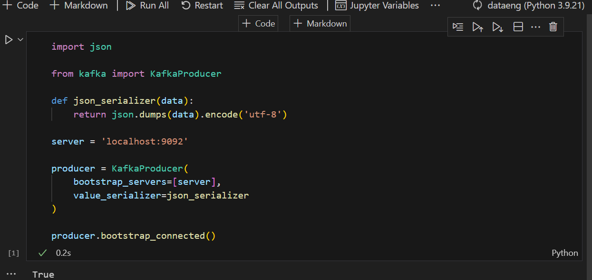
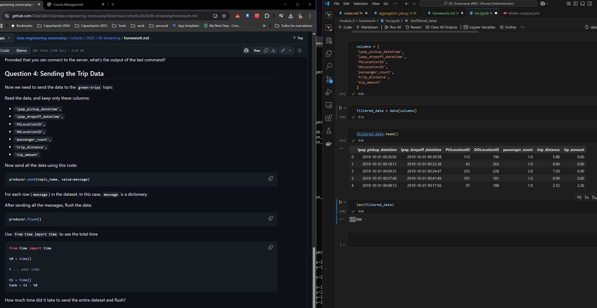
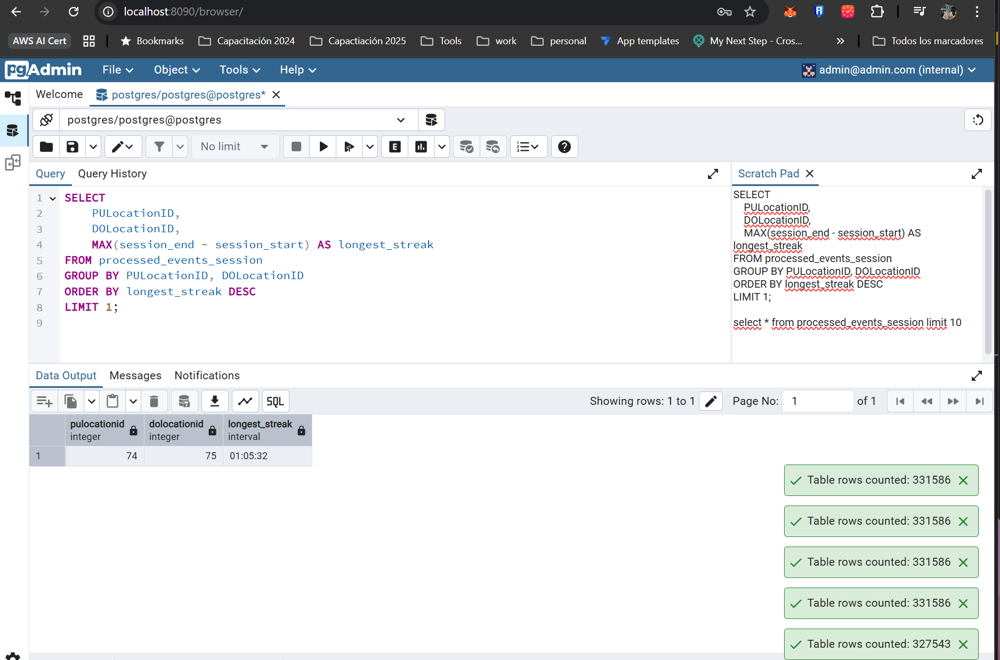

# Question 1

- Red Panda Version

rpk version v24.2.18 (rev f9a22d4430)

# Question 2

- Create topic

docker compose exec redpanda-1 rpk topic create green-trips

# Question 3

- Connect to redpanda (Kafka Server)

True

# Question 4

- Time to send the trip data

124.35 segundos

# Question 5

- Longest unbroken streak
74 and 75

